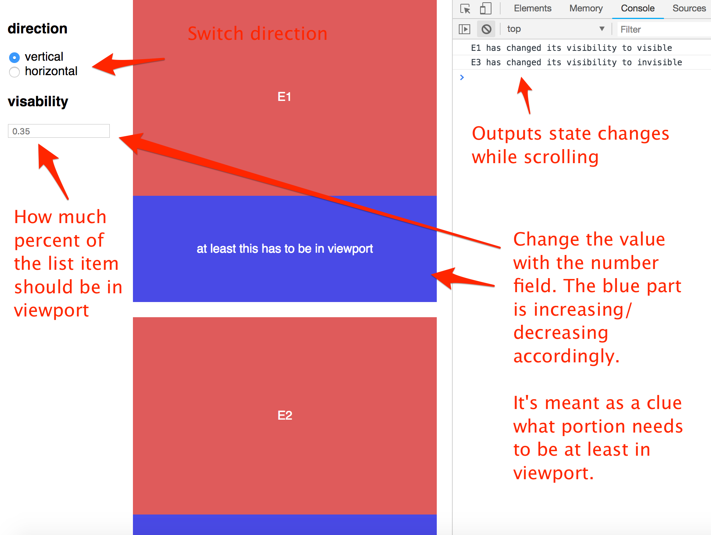

# react-viewport-playground

React playground for writing algorithms to determine whether DOM elements are inside viewport with respect to different requirements. E.g., is an element 40% vertically visible?



## Things I wanted to learn

With this project I want to learn or improve the following things:

- Improve my React skills in general
- What are [Refs](https://reactjs.org/docs/refs-and-the-dom.html) and how to use them
- How to use scroll events in React
- How to determine whether an element is inside the viewport
- How to use low-level DOM API (e.g., [Element.getBoundingClientRect()](https://developer.mozilla.org/en-US/docs/Web/API/Element/getBoundingClientRect)) in React
- Improve my testing skills with [Jest](https://jestjs.io/) and [react-testing-library](https://github.com/kentcdodds/react-testing-library)
- How to read and write [custom properties](https://developer.mozilla.org/en-US/docs/Web/CSS/--*) from Javascript.

## Using the demo

Just clone the repo

```bash
$ git clone git@github.com:doppelmutzi/react-viewport-playground.git
```

Go to the root folder and install the dependencies

```bash
$ yarn
```

Run the demo

```bash
$ yarn start
```

It should open automatically on port _3000_.

Execute the tests in watch mode

```bash
$ yarn test
```
